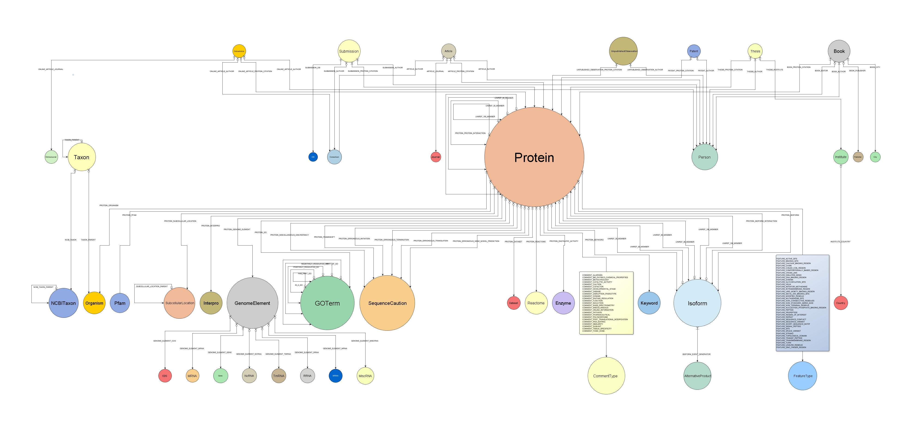

% Bio4j
% [Pablo Pareja](http://twitter.com/pablopareja)
% GraphDevRoom 2014

----

## what is Bio4j

Bio4j is a bioinformatics graph based database including most data available in [UniProt KB](http://www.uniprot.org/help/uniprotkb) (SwissProt + Trembl), [Gene Ontology](http://www.geneontology.org/) (GO), [UniRef](http://www.uniprot.org/help/uniref) (50,90,100), [RefSeq](http://www.ncbi.nlm.nih.gov/RefSeq/), [NCBI taxonomy](http://www.ncbi.nlm.nih.gov/Taxonomy/), and [Expasy Enzyme DB](http://enzyme.expasy.org/).

<!-- 4 or more '-' create a new slide -->
----

### open source

- **code** **[AGPLv3](https://www.gnu.org/licenses/agpl-3.0.html)**
- **data** integrates only **[open data](http://okfn.org/opendata/)**
- implementation/releasing process is 100% public and totally transparent

----

### biology & DBs today

* Problems with technology choices (RDB and so on)
* Biology is a graph and all that blablabla

----

### data sources - modules

<!-- 
  the '>' symbol here is for showing items incrementally 
-->
> * Gene Ontology (GO)
> * ExPASy Enzyme DB
> * RefSeq

----

### data sources - modules

> * UniRef --> 50, 90, 100
> * NCBI taxonomy tree -> GI index
> * Uniprot KB -> Swissprot/Trembl, interactions...

----

###  numbers

**Some numbers**

* `1,216,993,547` relationships
* `190,625,351` nodes
* `584,436,429` properties
* `144` relationship types
* `42` node types

----

### a bit of history

* How it all started (Gene Ontology & BG7)
* How it became the BigData platform it is today

----

### the property graph model

* Simple explanation with a couple of samples

----

### Bio4j structure

Modules and relationship among them

----

### Bio4j APIs

> 1. abstract **domain model**
> 2. **Blueprints** implementation
> 3. **technology-specific** versions

----

### domain model

Diagram (maybe also Bio4jExplorer??)

----

<!-- 
  it looks deformed because of the aspect ratio; it should be at least 4:3
-->

----

### domain model _why?_

- abstract over Blueprints
- more precise **typing**
- implementations can use technology-specific features

----

**Key advantage** 

_Different_ **graph topologies** at the storage level, _same_ **domain model**. 

Example: use **type nodes** in _Titan_, **labels** in _Neo4j_.

----

### Blueprints layer

A default **[Blueprints](https://github.com/tinkerpop/blueprints/)** implementation of the abstract model.

----

Apart from the set of interfaces developed as the **first layer** for the _domain model_ there's an **extra layer** that uses _Blueprints_. This way we’re going one step further for making the domain model **independent** from the choice of _database technology_

----

### technology-specific

Optimizations, features, etc.

* **[Neo4j](https://github.com/neo4j/neo4j)** 
* **[Titan](https://github.com/thinkaurelius/titan/)** (WIP)
* **[OrientDB](https://github.com/orientechnologies/orientdb/)** (planned)

----

### why Neo4j

> * wide **adoption**
> * stable
> * **Cypher**

----

### why Titan

> * **local!** indexes
> * **on-disk** access
> * **type** definitions -> _constraints!_

----

#### Bio4j and the cloud

* Interoperability and data distribution
* Backup and storage
* Scalability
* Cost-effective
* Applications and service providers on the cloud

----

### dev and release process

* coordinate **data** and **code**
* **[Semantic Versioning](http://semver.org/spec/v2.0.0.html)**
* **Cloud** integration, distribution, deployment, ...

----

### how?

- **[Statika](http://ohnosequences/statika)** cloud, data + code, modules (see [next talk](https://fosdem.org/2014/schedule/event/graphdevroom_bio4j_1/))
- **[sbt](https://github.com/sbt/sbt)** build Java + Scala, automated Bio4j-specific test & release
- **[git + github](https://github.com/bio4j)** versioning, docs, collaboration, coordination

----

### use cases

Our tools

* **[bg7](http://bg7.ohnosequences.com)** genome annotation
* **mg7** metagenomics analysis
* ...

----

### use cases

* **Ohio State University** explain, explain

----

### use cases

* **Berkeley** explain, explain

----

### community

* **[\@bio4j](http://twitter.com/bio4j)** twitter
* **[bio4j](https://github.com/bio4j)** github org
* **[bio4j-user](http://groups.google.com/group/bio4j-user)** google group
* **[bio4j](http://www.linkedin.com/groups/Bio4j-3890937)** linkedin

----

### team

- **[Pablo Pareja](http://ohnosequences.com/ppareja)**  
    project leader & main dev
- **[Eduardo Pareja-Tobes](http://ohnosequences.com/eparejatobes)**  
    technology, architecture
- **[Raquel Tobes](http://ohnosequences.com/rtobes)**  
    bio data integration

----

### team

- **[Alexey Alekhin](http://ohnosequences.com/aalekhin)**  
    Statika, release process, dev
- **[Marina Manrique](http://ohnosequences.com/mmanrique)**  
    bio data integration
- **[Evdokim Kovach](http://ohnosequences.com/ekovach)**  
    dev

----