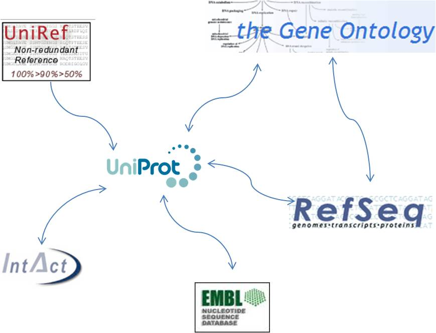
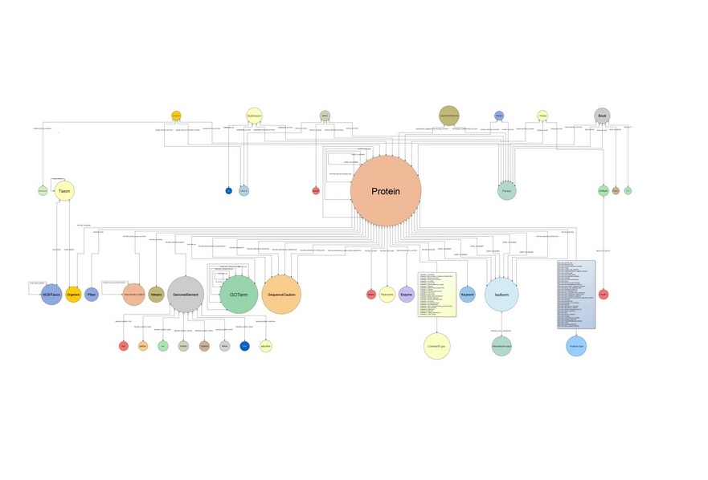

% Bio4j
% **[Pablo Pareja](http://twitter.com/pablopareja)**
% [**GraphDevRoom 2014**](http://graphdevroom.org)

<!-- 
  Sections

  - what is Bio4j
  - why Bio4j
      - why graphs bio stuff
      - why graph DBs
      - why cloud
  - details?
      - data
      - model
      - technologies
      - other stuff -> dev etc
  - how Bio4j
      - use cases
      - case studies
      - contact/support/dev/whatever
  - who Bio4j
      - era7 and oh no sequences!
      - team
-->

 
 

### _what_ is Bio4j

----

### in one sentence

**Bio4j** is a bioinformatics _graph_-based data platform **integrating** most data available in the most representative **open data sources** around **protein information** available today.

----

### data

* *[UniProt KB](http://www.uniprot.org/help/uniprotkb)* (SwissProt + Trembl)
* *[Gene Ontology](http://www.geneontology.org/)* (GO) 
* *[UniRef](http://www.uniprot.org/help/uniref)* (50,90,100)
* *[RefSeq](http://www.ncbi.nlm.nih.gov/RefSeq/)*
* *[NCBI taxonomy](http://www.ncbi.nlm.nih.gov/Taxonomy/)*
* *[Expasy Enzyme DB](http://enzyme.expasy.org/)*

<!-- 4 or more '-' create a new slide -->

----

### open!

- **code** **[AGPLv3](https://www.gnu.org/licenses/agpl-3.0.html)**
- **data** integrates only **[open data](http://okfn.org/opendata/)**
- **implementation & release** process is 100% public and totally **transparent**

----

 
 

### _why_ Bio4j?

bio data + graph databases + the cloud

----

### biology & DBs today

Highly **interconnected** overlapping knowledge **spread** through _different databases_

----

----

### why graphs

In most cases all data is modeled in _**Relational Databases**_ or sometimes even just as plain _**`CSV` files**_.

----

### why graphs

That might be OK for simple scenarios but as the **amount** and **diversity** of **data grows**, **domain models** become crazily **complicated**!

----

----

### why graphs

With a relational paradigm the double implication

**Entity** <--> **Table**

does not go both ways

----
 
### _not-so-good_ implications

* **Auxiliary tables**
* **Artificial IDs**
* Dealing with **raw tables** (in spite of Entity-relationship diagrams)
* **Integrating** new knowledge becomes **difficult**

----

### biology _!=_ table

**Life** in general and **biology** in particular are probably not 100% like a graph...

but one thing's sure, they _**are not a set of tables!**_

----

### why graph databases

* **Data** stored in a way that **semantically represents its own structure**
* Incorporating new data is easy --> **scalability** 

----

### why graph databases

* **Vertex-centric** _(local)_ indices allow for complex traversals --> overcoming **supernode problem**

----

### cloud

* data as a service
* machine configurations

----

 
 

### _details_ about Bio4j

data, model, technologies, APIs...

---- 

<!-- Details about Bio4j -->

 
 

### a bit of _history_

From the beginnings to the BigData platform it is today

----

### How it all started 

* Need for **massive access** to _Gene Ontology_ annotations
* [**BG7**](http://bg7.ohnosequences.com/) bacterial genome annotation system 
* Need for massive direct access to **protein information**

----

### more and more data!

* As _other_ data sources were becoming a _bottleneck_ they were being added to Bio4j
* First it was Uniprot KB, then Uniref and **we didn't stop yet :)**

----

###  numbers

* $10^9$ edges
* $2 \times 10^8$ nodes
* $6 \times 10^8$ properties
* $150$ edge types
* $40$ node types

<!-- * **`1,216,993,547`** relationships
* `190,625,351` nodes
* `584,436,429` properties
* `144` relationship types
* `42` node types
 -->
----

### Bio4j structure

Bio4j importing process is **modular** and **customizable** allowing you to import just the data you are interested in.

----

### data sources - modules I

> * Gene Ontology (GO)
> * ExPASy Enzyme DB
> * RefSeq

----

### data sources - modules II

> * UniRef -> 50, 90, 100
> * NCBI taxonomy tree -> GI index
> * Uniprot KB -> Swissprot/Trembl, interactions...

----

### data sources - modules III

Just keep in mind that you must be **coherent**
 
_e.g. you cannot import protein interactions if you didn't import any protein yet!_

----

### Bio4j APIs

> 1. abstract **domain model**
> 2. **Blueprints** implementation
> 3. **technology-specific** versions

----

### domain model

Bio4j database has a **well-defined** domain model and all nodes and relationships comply with this abstract model

----

----

### domain model _why?_

- abstract over Blueprints
- more precise **typing**
- implementations can use technology-specific features

----

### Key advantage

_Different_ **graph topologies** at the storage level, _same_ **domain model**. 

Example: use **type nodes** in _Titan_, **labels** in _Neo4j_.

----

### Blueprints layer

A default **[Blueprints](https://github.com/tinkerpop/blueprints/)** implementation of the abstract model.

----

Apart from the set of interfaces developed as the **first layer** for the _domain model_ there's an **extra layer** that uses _Blueprints_. This way we’re going one step further for making the domain model **independent** from the choice of _database technology_

----

### technology-specific

Optimizations, features, etc.

* **[Neo4j](https://github.com/neo4j/neo4j)** 
* **[Titan](https://github.com/thinkaurelius/titan/)** (WIP)
* **[OrientDB](https://github.com/orientechnologies/orientdb/)** (planned)

----

### why Neo4j

> * wide **adoption**
> * stable
> * **Cypher**

----

### why Titan

> * **local!** indexes
> * **on-disk** access
> * **type** definitions -> _constraints!_

----

### Bio4j and the cloud

* **Interoperability** and data distribution
* **Backup** and **storage**
* **Scalability**
* Applications and service providers on the cloud
* Cost-effective

----

### dev and release process

* coordinate **data** and **code**
* **[Semantic Versioning](http://semver.org/spec/v2.0.0.html)**
* **Cloud** integration, distribution, deployment, ...

----

### how?

- **[Statika](http://ohnosequences/statika)** cloud, data + code, modules (see [next talk](https://fosdem.org/2014/schedule/event/graphdevroom_bio4j_1/))
- **[sbt](https://github.com/sbt/sbt)** build Java + Scala, automated Bio4j-specific test & release
- **[git + github](https://github.com/bio4j)** versioning, docs, collaboration, coordination

----

 
 

<!-- How Bio4j -->
### _how_ to use Bio4j?

use cases, case studies, community

----

### use cases

<!--
----

### ??? and !!!

I don't get what's this... :|
-->

----

### how we use it

* **[bg7](http://bg7.ohnosequences.com)** genome annotation
* **mg7** metagenomics analysis
* comparative genomics, network analysis, genome assembly, ...

----

### case study II

**Ohio State University**

 * **Integration** and **analysis** of Chip-seq data
 * **Modeling** genomic information and **gene regulatory networks**

----

### case study III

**Berkeley Phylogenomics Group**

* Graph database for _Big Data challenges_ in **genomics** developed **on top of Bio4j**

----

### community

* **[\@bio4j](http://twitter.com/bio4j)** twitter
* **[bio4j](https://github.com/bio4j)** github org
* **[bio4j-user](http://groups.google.com/group/bio4j-user)** google group
* **[bio4j](http://www.linkedin.com/groups/Bio4j-3890937)** linkedin

----

 
 

<!-- How Bio4j -->
### _who_'s doing Bio4j?

research group, team

----

### oh no sequences!

**[Era7 bioinformatics](http://era7bioinformatics.com)** R&D group

- **web** -> [ohnosequences.com](http://ohnosequences.com)
- **Github** -> [ohnosequences](https://github.com/ohnosequences)

----

### team

- **[Pablo Pareja](http://ohnosequences.com/ppareja)**  
    project leader & main dev
- **[Eduardo Pareja-Tobes](http://ohnosequences.com/eparejatobes)**  
    technology & architecture
- **[Raquel Tobes](http://ohnosequences.com/rtobes)**  
    bio data integration

----

### team

- **[Alexey Alekhin](http://ohnosequences.com/aalekhin)**  
    Statika, release process, dev
- **[Marina Manrique](http://ohnosequences.com/mmanrique)**  
    bio data integration
- **[Evdokim Kovach](http://ohnosequences.com/ekovach)**  
    dev
	
----
