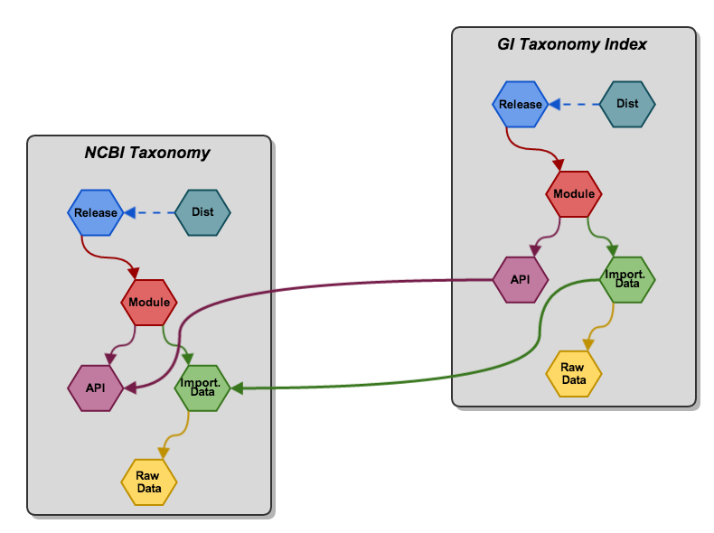

% Bio4j + Statika
% [Alexey Alekhin](http://ohnosequences.com/aalekhin)
% Graph Devroom @ FOSDEM 2014

# Bio4j modules

----

### Bio4j data sources 

\ 

<aside class="notes">
+ Bio4j bioinformatics graph database is modular and customizable
+ It integrates a lot of data from different sources 
</aside>

----

### Bio4j modules hierarchy

\   

<aside class="notes">
+ This diagram illustrates a set of Bio4j modules and their interdependencies
+ Every module represents quite a big amount of data, so it is useful to have 
  a release of Bio4j, which includes only data you need
</aside>

----

### Bio4j custom releases

\   

<aside class="notes">
For example ...
</aside>

----

### Bio4j custom releases

\   

<aside class="notes">
But of course we need to take into account dependencies between these modules
</aside>

----

### Goals

- Flexible module system
- Simple import process
- Dependencies management
- Easy and robust deployment

<aside class="notes">
So when developing the module system of Bio4j, we want ...
</aside>

# Statika

----

### What is Statika

\ 

<aside class="notes">
+ And here comes Statika!
+ It is a set of Scala libraries which allows you to declare dependencies between 
  components of any modular system and track their correctness using Scala type 
  system. 
+ It has several layers, and can be seen as...
</aside>

----

### Abstract module system

- Modules as Scala types — _bundles_
- They can _depend_ on each other!
- It's validated by compiler —  
  i.e. _statically_
- Linearizing types graph to get them in the right order

<aside class="notes">
First of all as an _abstract_ module system. <read the list>
Keywords:
* install method and installing with deps in the right order
* acyclic directed graph of type dependencies
* shapeless, heterogeneous lists and etc.
* type-level traversing and linearization 
</aside>

----

### Managing artifacts

- Packing bundles into versioned artifacts (jars)
- Reusing [SBT](http://www.scala-sbt.org/) (Simple Build Tool) infrastructure 
  <!-- it tracks dependencies on the artifact level -->
- Standardizing settings and release process with the [sbt-statika plugin](https://github.com/ohnosequences/sbt-statika)

----

### Deployment

[Amazon Web Services](http://aws.amazon.com/) + [aws-statika lib](https://github.com/ohnosequences/aws-statika)

- Bundles can be _applied_, i.e. deployed it to an EC2 instance
- Statika _distributions_ — an abstraction for the cloud infrastructure specifics

<aside class="notes">
+ Thanks to this, it's possible now to deploy only selected components of the 
  integrated data sets, with Amazon Web Services deployments on hardware specifically 
  configured for them.
+ Distributions are just a declaration that a set of bundles can be applied
  with particular infrastructure-specific settings
</aside>

# Bio4j + Statika

<!-- the main part, so the previous introductory parts shouldn't be too long -->

----

### Defining Bio4j modules

- Raw data
- Node/relations type defs
- Importing process
- Exposing some API

<aside class="notes">
+ All modules have similar inner structure
+ It should be decomposed and represented as a hierarchy of bundles
+ So every module ... <read the list>
</aside>

----

### Inner bundles layout

\ 

<!-- quick explanation of the terminology -->

----

### Inner bundles layout example

\ 

<aside class="notes">
Relation between modules on the bundles level:
+ respecting dependencies on different levels
+ it's all complex enough to not track it manually
+ Statika checks correctness and linearizes this deps graph!
</aside>

----

### Incremental import

- Incremental import of data  
  to existing Bio4j distributions
- Not repeating already done work
- Easy to describe abstractly

----

### Incremental import example

\ 

<!-- this is a structure which reuses already existing distribution -->

----

### Custom release of Bio4j

- create a release-bundle with needed modules
- be sure not to spend resources on a wrong configuration —  
  compile it!
- use tools for easy release and deployment:  
  [sbt-statika](https://github.com/ohnosequences/sbt-statika) + [statika-cli](https://github.com/ohnosequences/statika-cli)

# Summary

----

### Bio4j + Statika = win!

- _Abstract_ layout of bundles <!-- for any Bio4j module -->
- Hierarchy of _concrete_ modules <!-- which conform to this layout and have their own deps -->
- Tracking deps on _all levels_ <!-- "automatically" on all levels -->
<!-- - Linearizing them _automatically_ — we just want to do things in the right order -->
- Doing it at _compile time_
- Using AWS _cloud_ infrastructure  
  for the actual work
