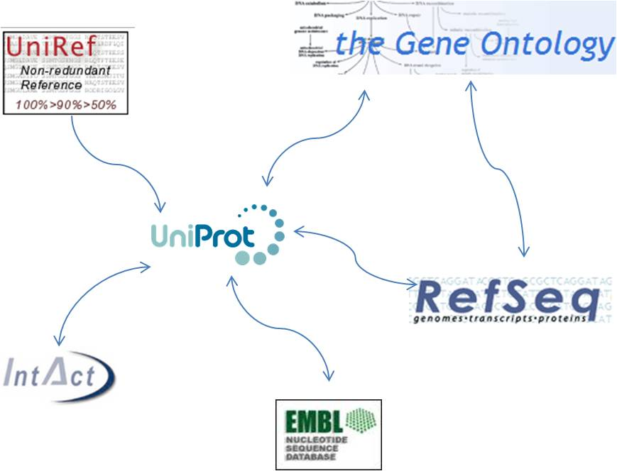

% Bio4j + Statika
% [Alexey Alekhin](http://ohnosequences.com/aalekhin)
% FOSDEM GraphDevRoom 2014

# Bio4j + Statika: Managing module dependencies on the type level

<!-- Abstract from the FOSDEM site:
Bio4j bioinformatics graph database is modular and customizable, allowing you to import just the data you are interested in. There exist, though, dependencies among these resources that must be taken into account and that's where Statika enters the picture; a set of Scala libraries which allows you to declare dependencies between components of any modular system and track their correctness using Scala type system. Thanks to this, it's possible now to deploy only selected components of the integrated data sets, with Amazon Web Services deployments on hardware specifically configured for them.
-->

<!-- General (toplevel) structure:
* Bio4j modules   = customizability (important and useful)
* Statika         = a generic module system (generic and static)
* Bio4j + Statika = happiness/awesomeness/allgoodthingsintheworldtogether (for developers and users)
-->

----

## Bio4j modules

----

<!-- you already saw this diagram and it just shows that 
Bio4j integrates a lot of data from _different_ sources -->

----

\   

<!-- actually it's a bit more involved -->

----

### Custom Bio4j releases

- [NCBI Taxonomy] + [GI index]  
    for metagenomics tool
- ??? moar examples ???

<!--
- a lot of data in modules => 
  importance of possibility to import only what you really need
- different releases/distributions/builds
- may be some examples of interesting/useful/non-obvious combinations (ask @pablopareja)
- real need of systemized/organized way of managing these modules

* releases as combinations of modules + example(s)
* why do we need to do smth with all this (i.e. why statika is needed at all),
-->

----

## What is Statika

----

### A module system

Scala type system: [shapeless](https://github.com/milessabin/shapeless) + [statika](https://github.com/ohnosequences/statika)

- modules as Scala types
- they can depend on each other!
- it's validated by type-checker
- statika does linearization of the deps graph

<!-- keywords: 
* mention install method and installing with deps in the right order
* acyclic directed graph
* shapeless, heterogeneous lists and etc.
* type-level traversing and linearization 
* ? 
-->

----

### A package manager

[SBT](http://www.scala-sbt.org/) (Simple Build Tool) + [sbt-statika plugin](https://github.com/ohnosequences/sbt-statika)

- Bundles packed and released as versioned artifacts (jars)
- SBT tracks dependencies on the artifact level
- Statika provides an SBT-plugin for a standardized release process

<!-- may be it shouldn't be too detailed, a bit offtopic -->

----

### A deployment tool

[AWS](http://aws.amazon.com/) (Amazon Web Services) + [aws-statika lib](https://github.com/ohnosequences/aws-statika)

- To "apply" a bundle — to deploy it to an EC2 instance
- Statika distributions — an abstraction for the cloud infrastructure specifics
- Statika as a configuration system

<!-- needs to be structured better -->

----

## Bio4j + Statika

<!-- the main part, so the previous introductory parts shouldn't be too long -->

----

### Defining inner bundles hierarchy

- what is a module of Bio4j — viewing it's inner structure:
  + raw data
  + database initialization (type definitions etc.)
  + importing process
  + providing API
- pic of the hierarchy

----

### Relation between modules on the bundles level

- respecting dependencies on different levels
- pic of two modules with their bundles structure with inner dependencies
- it's all complex enough to not track it manually
- Statika checks correctness and linearizes this deps graph!

----

### Incremental import

- incremental import of modules to existing releases
- examples: different combinations, not repeating already done work
- possibility to do it abstractly with (some extensions of) Statika

----

### Ease of releasing Bio4j

- create a bundle with needed modules
- be sure not to spend resources on a wrong configuration
- use tools for easy deployment: 
    sbt-statika + statika-cli

----

### Summary: Bio4j + Statika

- _abstract_ layout of bundles <!-- for any Bio4j module -->
- a set of _concrete_ modules <!-- which conform to this layout and have their own deps -->
- tracking dependencies on _all levels_ <!-- "automatically" on all levels -->
- linearizing them _automatically_ <!-- we just want to do things in the right order -->
- using the _cloud_ infrastructure <!-- for doing actual work -->
