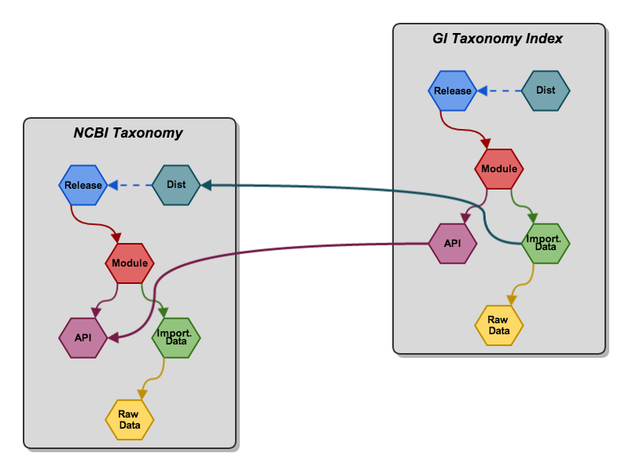

% Bio4j + Statika
% [Alexey Alekhin](http://ohnosequences.com/aalekhin)
% Graph Devroom @ FOSDEM 2014

<!-- Bio4j + Statika: Managing module dependencies on the type level

General (toplevel) structure:
* Bio4j modules   = customizability (important and useful)
* Statika         = a generic module system (generic and static)
* Bio4j + Statika = happiness/awesomeness/allgoodthingsintheworldtogether (for developers and users)
-->

## Bio4j modules

<!--------------------------------------------------------------------------------
+ Bio4j bioinformatics graph database is modular and customizable
+ It integrates a lot of data from different sources 
--------------------------------------------------------------------------------->

----

\   

<!--------------------------------------------------------------------------------
+ This diagram illustrates a set of Bio4j modules and their dependencies
+ These dependencies should be taken into account when the data is imported from 
  those sources
--------------------------------------------------------------------------------->

----

### Custom Bio4j releases

- [NCBI Taxonomy] + [GI index]  
    for metagenomics tool
- ??? moar examples ???

<!--------------------------------------------------------------------------------
+ Every module represents quite a big amount of data, 
  so it is useful to have a release/build/distribution/WHAT? of Bio4j,
  which includes only data you need
+ For example, <taxonomy modules for metapasta>
--------------------------------------------------------------------------------->

<!-- more points: (???)
* real need of systemized/organized way of managing these modules
* releases as combinations of modules + example(s)
* why do we need to do smth with all this (i.e. why statika is needed at all)
-->

----

## What is Statika

<!--------------------------------------------------------------------------------
Essentially, it is a set of Scala libraries which allows you to declare 
dependencies between components of any modular system and track their correctness 
using Scala type system.
It has several layers, and can be seen as...
--------------------------------------------------------------------------------->

----

### A module system

<!-- [shapeless](https://github.com/milessabin/shapeless) + [statika](https://github.com/ohnosequences/statika) -->

- Modules as Scala types — _bundles_
- They can _depend_ on each other!
- It's validated by compiler —  
  i.e. _statically_
- Linearizing types graph to get them in the right order

<!--------------------------------------------------------------------------------
First of all as an _abstract_ module system. <read the list>
Keywords:
* install method and installing with deps in the right order
* acyclic directed graph of type dependencies
* shapeless, heterogeneous lists and etc.
* type-level traversing and linearization 
--------------------------------------------------------------------------------->

----

<!-- not sure if this is needed for anything -->

----

### A package manager

- Packing bundles into versioned artifacts (jars)
- Reusing [SBT](http://www.scala-sbt.org/) (Simple Build Tool) infrastructure 
  <!-- it tracks dependencies on the artifact level -->
- Standardizing settings and release process with the [sbt-statika plugin](https://github.com/ohnosequences/sbt-statika)

----

### A deployment tool

[AWS](http://aws.amazon.com/) (Amazon Web Services) + [aws-statika lib](https://github.com/ohnosequences/aws-statika)

- Bundles can be _applied_, i.e. deployed it to an EC2 instance
- Statika _distributions_ — an abstraction for the cloud infrastructure specifics

<!--------------------------------------------------------------------------------
+ Thanks to this, it's possible now to deploy only selected components of the 
  integrated data sets, with Amazon Web Services deployments on hardware specifically 
  configured for them.
+ Distributions are just a declaration that a set of bundles can be applied
  with particular infrastructure-specific settings
--------------------------------------------------------------------------------->

----

## Bio4j + Statika

<!-- the main part, so the previous introductory parts shouldn't be too long -->

----

### Defining Bio4j modules

Decomposing it:

- Raw data
- Node/relations type defs
- Importing process
- Exposing some API

<!--------------------------------------------------------------------------------
+ All modules have similar inner structure
+ It should be decomposed and represented as a hierarchy of bundles
+ So every module ... <read the list>
--------------------------------------------------------------------------------->

----

### Inner bundles layout

\ 

<!-- quick explanation of the terminology -->

----

<!--------------------------------------------------------------------------------
Relation between modules on the bundles level:
+ respecting dependencies on different levels
+ it's all complex enough to not track it manually
+ Statika checks correctness and linearizes this deps graph!
--------------------------------------------------------------------------------->

----

### Incremental import

- incremental import of modules to existing distributions
- not repeating already done work
- possibility to control it abstractly

----

<!-- So again, this is a usual structure -->

----

<!-- And this is a structure which reuses already existing deistributions -->

----

### Ease of releasing Bio4j

- create a bundle with needed modules
- be sure not to spend resources on a wrong configuration
- use tools for easy deployment: 
    sbt-statika + statika-cli

----

### Summary: Bio4j + Statika

- _abstract_ layout of bundles <!-- for any Bio4j module -->
- a set of _concrete_ modules <!-- which conform to this layout and have their own deps -->
- tracking dependencies on _all levels_ <!-- "automatically" on all levels -->
- linearizing them _automatically_ <!-- we just want to do things in the right order -->
- using AWS _cloud_ infrastructure  
  for doing hard work
